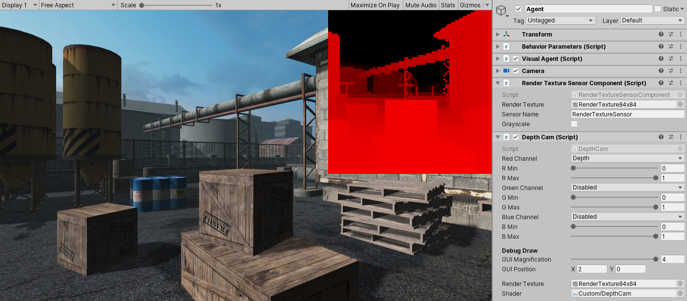
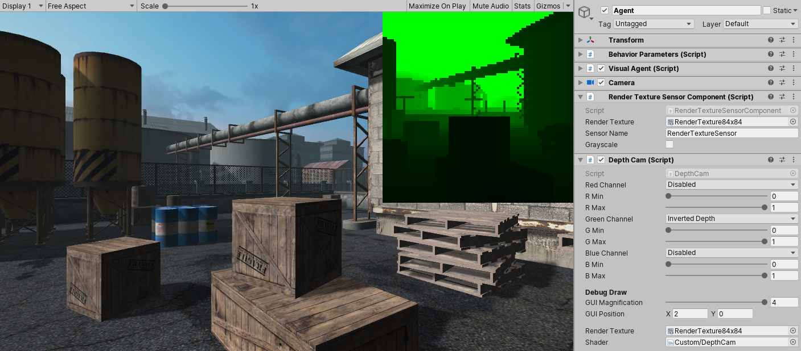
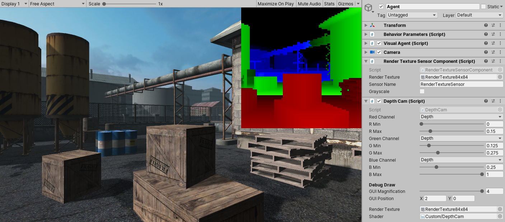
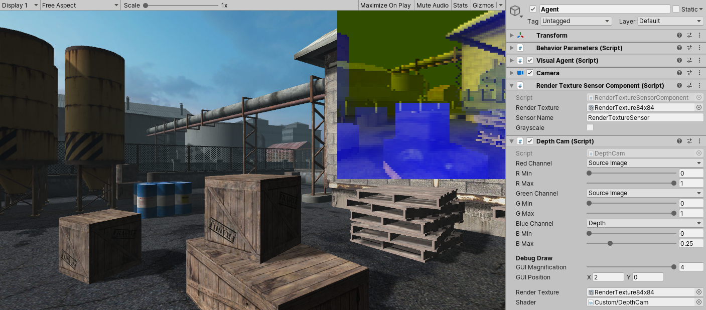
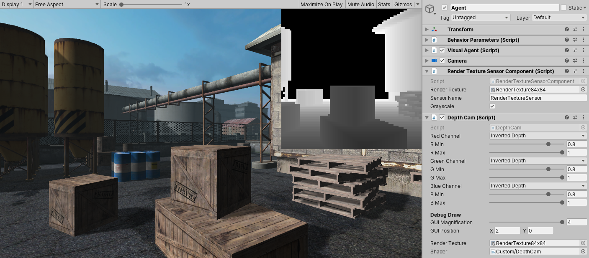

## Unity Depth Camera

Provides a quick and easy way to map [depth texture](https://docs.unity3d.com/Manual/SL-CameraDepthTexture.html) values to RGB channels. I wrote it for feeding depth info to [Unity Machine Learning Agents](https://github.com/Unity-Technologies/ml-agents) as visual observations.

You can define distance ranges by setting min and max values. Clamped distances are being mapped to the full 8-bit color range. Default depth values are flipped so that close objects are more saturated than farther-away ones.

### Example settings

Red channel only.  

Green channel only with inverted depth values.  

One color channel per distance range, increases the total depth resolution compared to using a single channel.  

Blue channel limited to foreground, mixed with source image's red and green channels.  

All channels limited to foreground, inverted.  

